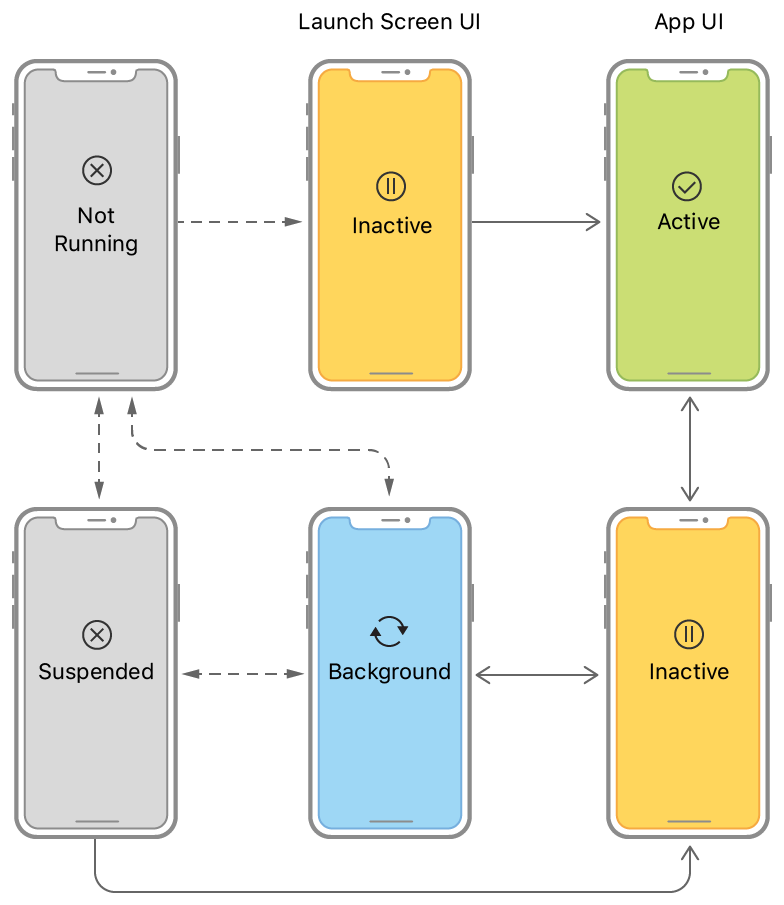

# Managing Your App's Life Cycle

## Overview

- 앱의 현재 상태는 앱이 현재 할 수 있는 일과 할 수 없는 일을 결정합니다. 예를들어, foreground app은 유저의 관심을 끌고 있고, CPU 등의 시스템 자원에 대해 가장 높은 우선순위를 지닙니다. 
- 대조적으로, backgorund app은 관심도가 가장 낮고, 일반적으로 offscreen 상태에서는 아무일도 하지 않습니다. 
- 따라서, 앱의 상태가 변화함에 따라 앱의 행동을 적절하게 조정해야 합니다.

App의 상태가 변화할 때, UIKit는 적당한 delegate object의 메서드를 호출함으로써 당신에게 이를 알립니다.

- iOS 13 이후 버전에서는 scene-based app에 대해 life-cycle 이벤트에 대해 대응하기위해  [`UISceneDelegate`](https://developer.apple.com/documentation/uikit/uiscenedelegate) objects를 사용합니다.
- iOS 12와 이전 버전에서는 [`UIApplicationDelegate`](https://developer.apple.com/documentation/uikit/uiapplicationdelegate) object 를 사용합니다.

> **Note**
>
> 앱에서 scene support가 지원가능하면, iOS 13 이후 버전에서  iOS는 항상 **scene delegates**를 사용합니다. 
>
> iOS 12 이전버전에서는 iOS 시스템은 **app delegate**를 사용합니다.

----

### Respond to App-Based Life-Cycle Events (~ iOS 12)

**iOS 12 이전 버전 및 support scenes 미지원 앱**

- UIKit는 모든 라이프 사이클 이벤트를 [`UIApplicationDelegate`](https://developer.apple.com/documentation/uikit/uiapplicationdelegate) 객체로 전달합니다. 

- App delegate는 별도 화면에 표시된 창을 포함하여 모든 앱의 window를 관리합니다. 
- 따라서, App 상태 전환은 외부 디스플레이의 컨텐츠를 포함하여 앱의 모든 UI에 영향을 줍니다.

다음 그림은 앱 delegate 객체와 관련된 상태 전환을 보여줍니다.

앱의 실행 후, 시스템은 앱의 UI가 스크린에 표시될지 여부에 따라 시스템이 앱을 inactive state 또는 background state로 전환합니다.

앱을 foreground로 시작할 때, 시스템은 앱을 자동으로 활성상태로 전환합니다.

이후에 state는 앱이 종료될 때 까지 active와 background 사이에서 변동합니다.

1. springboard : 앱이 실행되지 않은 기본 화면 (Not Running)

2. launch screen : 로딩되는 동안에만 잠시 실행되는 화면
3. swipe (앱 전환)를 위해 터치이벤트 작동시 Inactive가 되었다가, 다음 앱으로 전환시 기존 앱은 Background 상태가 된다. (만약 위로 swipe하여 앱을 종료시키면 해당 앱은 Not Running 상태가 된다.)
   1. Background 상태에서는 최소한의 core 작업만 허용이 된다. 가령, music app, gps, 전화, 녹음, 파일업로드/다운로드 등은 background로 실행이 가능하다.
4. Background에 있는 앱이 Suspended 상태로 남아있지만, iOS의 메모리 최적화에 의해 어느순간 Not Running 상태(앱 초기부터 실행)로 전환될 수 있다.

#### 아래의 태스크를 수행하기 위해 앱의 상태 전이를 사용합니다.

- 앱을 처음 실행할 때, 앱의 자료구조들과 UI를 초기화 합니다.  
  - [Responding to the Launch of Your App](https://developer.apple.com/documentation/uikit/app_and_scenes/responding_to_the_launch_of_your_app).
- 앱이 활성화 상태(activation)일 때, UI의 조정을 마치고, 사용자와 상호작용을 위한 준비를 합니다.
  -  [Preparing Your UI to Run in the Foreground](https://developer.apple.com/documentation/uikit/app_and_scenes/preparing_your_ui_to_run_in_the_foreground).
- 앱이 비활성화 상태(deactivation)로 넘어갈 때, 데이터를 저장하고 앱의 행동들을 최소화(quiet)한다.
  -  [Preparing Your UI to Run in the Background](https://developer.apple.com/documentation/uikit/app_and_scenes/preparing_your_ui_to_run_in_the_background).
- background 상태로 진입할 때, 중요한 태스크들을 마치고, 가능한 많은 메모리를 해제하며, 현재 앱의 스냅샷을 준비합니다.
  -  [Preparing Your UI to Run in the Background](https://developer.apple.com/documentation/uikit/app_and_scenes/preparing_your_ui_to_run_in_the_background).
- 앱을 종료할 때는 모든 작업을 즉시 멈추고 모든 공유 자원들을 해제합니다.
  -  [`applicationWillTerminate(_:)`](https://developer.apple.com/documentation/uikit/uiapplicationdelegate/1623111-applicationwillterminate).

라이프사이클 이벤트들을 관리하기 위해서, 앱은 아래 테이블에 기술된 이벤트들을 다루기 위해 준비과정이 필요합니다. [`UIApplicationDelegate`](https://developer.apple.com/documentation/uikit/uiapplicationdelegate) 은 대부분의 이벤트들을 핸들하기 위한 객체로 사용합니다. 경우에 따라 알림을 사용하여 앱을 처리 할 수도 있으므로 앱의 다른 부분에서 응답 할 수 있습니다.

|                                              |                                                              |
| -------------------------------------------- | ------------------------------------------------------------ |
| Memory warnings                              | Received when your app’s memory usage is too high. Reduce the amount of memory your app uses; see [Responding to Memory Warnings](https://developer.apple.com/documentation/uikit/app_and_scenes/managing_your_app_s_life_cycle/responding_to_memory_warnings). |
| Protected data becomes available/unavailable | Received when the user locks or unlocks their device. See [`applicationProtectedDataDidBecomeAvailable(_:)`](https://developer.apple.com/documentation/uikit/uiapplicationdelegate/1623044-applicationprotecteddatadidbecom) and [`applicationProtectedDataWillBecomeUnavailable(_:)`](https://developer.apple.com/documentation/uikit/uiapplicationdelegate/1623019-applicationprotecteddatawillbeco). |
| Handoff tasks                                | Received when an [`NSUserActivity`](https://developer.apple.com/documentation/foundation/nsuseractivity) object needs to be processed. See [`application(_:didUpdate:)`](https://developer.apple.com/documentation/uikit/uiapplicationdelegate/1622963-application). |
| Time changes                                 | Received for several different time changes, such as when the phone carrier sends a time update. See [`applicationSignificantTimeChange(_:)`](https://developer.apple.com/documentation/uikit/uiapplicationdelegate/1622992-applicationsignificanttimechange). |
| Open URLs                                    | Received when your app needs to open a resource. See [`application(_:open:options:)`](https://developer.apple.com/documentation/uikit/uiapplicationdelegate/1623112-application). |

----

### Respond to Scene-Based Life-Cycle Events (iOS 13~ )

- 앱이 **scene**을 지원하는 경우, UIKit는 각각에 대해 별도의 라이프 사이클 이벤트를 제공합니다. 
- Scene은 기기에서 실행중인 앱 UI의 한 인스턴스를 의미합니다.
- 사용자는 각 앱에 대해 여러 장면을 만들고 이를 개별적으로 표시하거나 숨길 수 있습니다. 
- 각 장면마다 고유 한 라이프 사이클이 있기 때문에 각 장면마다 다른 실행 상태가 될 수 있습니다. 
- 예를 들어 다른 scene들이 background에 있거나 일시 중단되있는 동안에 하나의 scene은 foreground에 있을 수 있습니다. 

> **Important**
>
> Scene support는 **opt-in 기능**입니다. 이 support를 활성화 시키려면 [UIApplicationSceneManifest](https://developer.apple.com/documentation/bundleresources/information_property_list/uiapplicationscenemanifest) key를 앱의 Info.plist에 추가합니다. 
>
> 시스템 요구사항과 유저 요구사항이 모두 만족해야 실행되는 기능입니다. 그렇지 않으면 iOS 12이전과 같은 방식으로 작동합니다.
>
> Info.plist에 추가하는 방식은 [Specifying the Scenes Your App Supports](https://developer.apple.com/documentation/uikit/app_and_scenes/specifying_the_scenes_your_app_supports) 을 참고

아래의 그림은 scene들간의 상태 전이를 보여줍니다.

- 유저나 시스템이 앱에 대해 새로운 scene을 요청하면, UIKit은 새로운 scene을 만들고, unattached state에 넣습니다. (해당 scene;unattached state 은 아직 앱의 특정 상태랑 결합되지 않은 상태라고 볼 수 있습니다.)
- 사용자가 요구한 scene들은 onscreen에 나타나기 위해 foreground로 신속하게 이동합니다. 
- 시스템이 요구한 scene들은 일반적으로 background로 이동하여 해당 scene들이 이벤트에 대해 진행할 수 있습니다. 
  - 예를들어, 시스템은 위치 이벤트를 진행하기 위해 scene을 background에서 실행합니다. 
  - 대부분의 app들은 (특정 조건이 없는 한) background 상태를 스치듯이 거쳐서 foreground로 갑니다.
    - background에서 실행할 수 있는 기능은 제한적으로, 음악재생, 녹음, gps 등의 기능만을 수행합니다.
- 유저가 앱의 UI를 끄면(dismiss), UIKit는 연관된 scene을 일단 background 상태로, 결국에는 suspended state 상태로 옮깁니다. UIKit은 자원의 회수나 해당 scene을 unattached state로 돌리기 위해 ( background | suspended ) scene의 연결을 언제든지 해제할 수 있습니다.

#### 아래의 태스크를 수행하기 위해 앱의 상태 전이를 사용합니다.

- UIKit가 scene을 앱에 연결할 때, scene의 초기 UI를 조정하고, scene이 필요로하는 data를 load합니다.

- foreground-active state로 상태를 전이할 때, UI를 조정하고, 유저 상호작용을 준비합니다.
  -  [Preparing Your UI to Run in the Foreground](https://developer.apple.com/documentation/uikit/app_and_scenes/preparing_your_ui_to_run_in_the_foreground).
- foreground-active state의 상태를 떠날 때, 데이터를 저장하고, app의 행동을 최소화합니다. 
  - [Preparing Your UI to Run in the Background](https://developer.apple.com/documentation/uikit/app_and_scenes/preparing_your_ui_to_run_in_the_background).
- background state로 진입할 때, 중요한 태스크를 마치고, 가능한 많은 메모리를 해제합니다. 또한 앱의 스냅샷을 준비합니다.
  - See [Preparing Your UI to Run in the Background](https://developer.apple.com/documentation/uikit/app_and_scenes/preparing_your_ui_to_run_in_the_background).
- scene의 연결이 끊길 때, scene과 연결된 모든 공유자원들을 해제합니다.
- scene 관련 이벤트를 추가할 때, [`UIApplicationDelegate`](https://developer.apple.com/documentation/uikit/uiapplicationdelegate) object을 사용하여 앱의 실행에 반응할 수 있게 해야 합니다
  -  For information about what to do at app launch, see [Responding to the Launch of Your App](https://developer.apple.com/documentation/uikit/app_and_scenes/responding_to_the_launch_of_your_app).